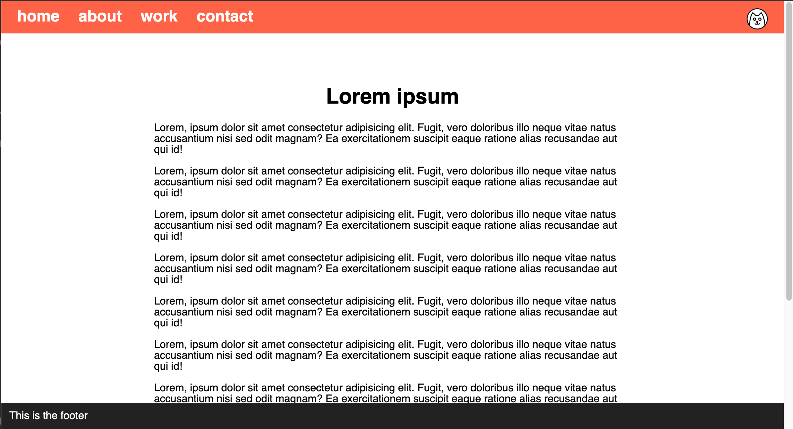

# Navigation und Fußzeile

Erstelle die Webseite, die in den Referenzbildern unten gezeigt wird.

### Anleitung

- Die Seite sollte so viel Inhalt haben, dass eine vertikale Bildlaufleiste (vertical scrollbar) erscheint
- Füge eine Navigationsleiste oben hinzu
- Platziere das Katzensymbol (cat icon) auf der rechten Seite der Navigationsleiste
- Füge eine Fußzeile (footer) hinzu
- Sowohl die Navigationsleiste als auch die Fußzeile müssen immer sichtbar sein
